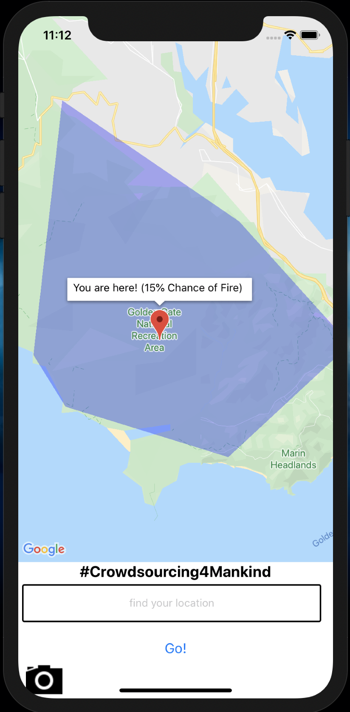

# Crowdsourcing4Mankind

## Frontend Contribution by Jennifer Ma:
https://github.com/jenniferhm

## Machine Learning by Raymond Wu:
https://github.com/RaymondDashWu

TODO Put image of screenshot + model

## API Design by Hong Tran:
https://github.com/Jessiehongtran

Hong's branch can be found here:
https://github.com/RaymondDashWu/ai4crowdsourcing-wildfire-hackathon/tree/image-API-branch

### Description
Crowdsourcing4Mankind is a mobile app geared towards the early detection of wildfires. The goal is to reduce the time it takes for a fire to be reported to authorities after it begins. The app was created as part of a hackathon run by [AI for Mankind](https://github.com/aiformankind)

#### Disclosure:
Crowdsourcing4Mankind is not complete. Key features and their current status are highlighted below. Please clone and create a pull request if you would like to contribute.

### How it Works:
- A user can use the app to find their location and see the likelihood of a fire forming in their area based on historical data and the current climate. 
- If the user spots smoke/fire, a picture can be taken through the app. 
- The image will be analyzed by the machine learning model, which will return a rating corresponding to the likelihood that there is a fire. 
- If the image scores above 70%, the user has the option of sending the image to the local authorities or to retake the image. 
- If the image scores below the threshold, then the user can choose to keep the image or delete it. 

### Primary Technologies:
- [React Native](https://facebook.github.io/react-native/docs/getting-started)
- [Google Maps API](https://developers.google.com/maps/documentation/javascript/tutorial)
- [React Native Maps](https://github.com/react-native-community/react-native-maps)
- [Core ML](https://developer.apple.com/machine-learning/core-ml/)
- [PyTorch](https://pytorch.org/)
- [fastai](https://www.fast.ai/)

### Key Features & Status:
- Location finder
  - Status: WIP - form needs to be completed and connected to backend
- Camera
  - Status: WIP - need to use react-native-camera or other camera API
- Polygon overlays of region with % of likelihood of fire based on current climate and historical data
  - Status: WIP - need to import historical fire data, temperature API, and add additional polygon overlays
- In-app ML model to recognize smoke in an image
  - Status: WIP
- Option to send image to local authorities if fire is detected
  - Status: WIP - need to add form to allow users to send image once threshold is reached
- Train model to detect wildfires
  - Status: Completed - model can be found [here](https://www.dropbox.com/s/7vp7yija989uy7u/stage-1.pth?dl=0). Note that this is a PyTorch model.
- Convert PyTorch model to Tensorflow
  - Status: WIP
- Convert Swift Core ML example to work `with React Native.
  - Status: WIP